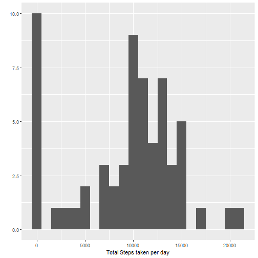
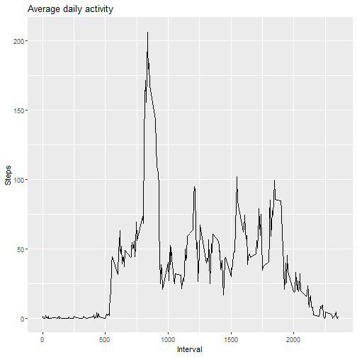
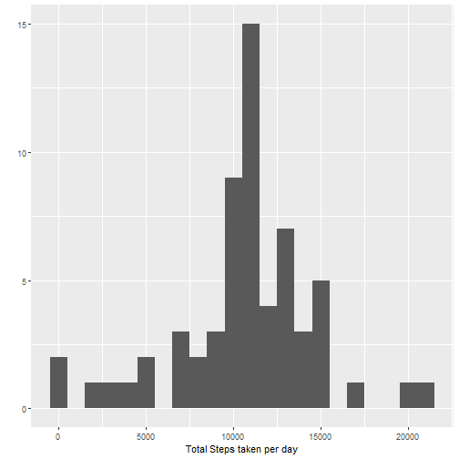
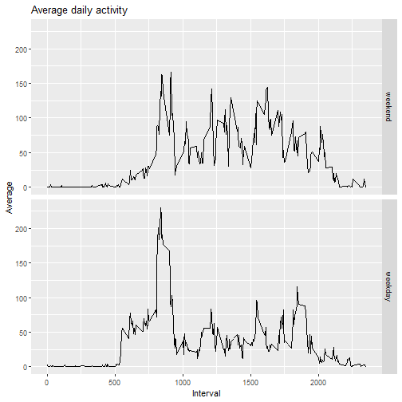

# Reproducible Research: Peer Assessment 1


## Loading and preprocessing the data

```r
library(dplyr)
library(ggplot2)
library(knitr)
temp<-"activity"
download.file("https://d396qusza40orc.cloudfront.net/repdata%2Fdata%2Factivity.zip",temp,mode="wb")
unzip(temp,"activity.csv")
df_na<-read.csv("activity.csv")
df<-subset(df_na,!(is.na(steps)))
```

## What is mean total number of steps taken per day?

```r
a<-tbl_df(df)
a<-group_by(a,date,.drop=FALSE)
a<-summarize(a,total=sum(steps))
qplot(a$total,binwidth=1000)+xlab("Steps")
```



```r
mean(a$total)
```

```
## [1] 9354.23
```

```r
median(a$total)
```

```
## [1] 10395
```


## What is the average daily activity pattern?

```r
b<-tbl_df(df)
b<-group_by(b,interval,.drop=FALSE)
b<-summarize(b,avg=mean(steps))
ggplot(b,aes(interval,avg))+geom_line()+ggtitle("Average daily activity")+xlab("Interval")+ylab("Steps")
```



Which 5-minute interval, on average across all the days in the dataset, contains the maximum number of steps?

```r
b[which.max(b$avg),][[1]]
```

```
## [1] 835
```

## Imputing missing values

```r
sum(is.na(df_na))
```

```
## [1] 2304
```

```r
c<-tbl_df(df)
new<-df_na
c<-group_by(c,interval,.drop=FALSE)
c<-summarize(c,avg=mean(steps))
c<-as.data.frame(c)
filler<-function(interval,steps){
	value<-NA
	if(is.na(steps))
	value<-c$avg[c$interval==interval]
	else
	value<-steps
	return(value)
	}
new$steps<-mapply(filler,new$interval,new$steps)
filled_in<-new
c<-new
c<-group_by(c,date,.drop=FALSE)
c<-summarize(c,total=sum(steps))
qplot(c$total,binwidth=1000)+xlab("Steps")
```



```r
mean(c$total)
```

```
## [1] 10766.19
```

```r
median(c$total)
```

```
## [1] 10766.19
```

## Are there differences in activity patterns between weekdays and weekends?

```r
filled_in$date<-as.Date(filled_in$date)
weekd<-c("Monday","Tuesday","Wednesday","Thursday","Friday")
filled_in$days<-factor((weekdays(filled_in$date) %in% weekd),levels=c(FALSE,TRUE),labels=c('weekend','weekday'))
d<-filled_in
d<-group_by(d,interval,days)
d<-summarise(d,avg=mean(steps))
ggplot(d,aes(x=interval,y=avg))+geom_line()+facet_grid(days~.)
```


